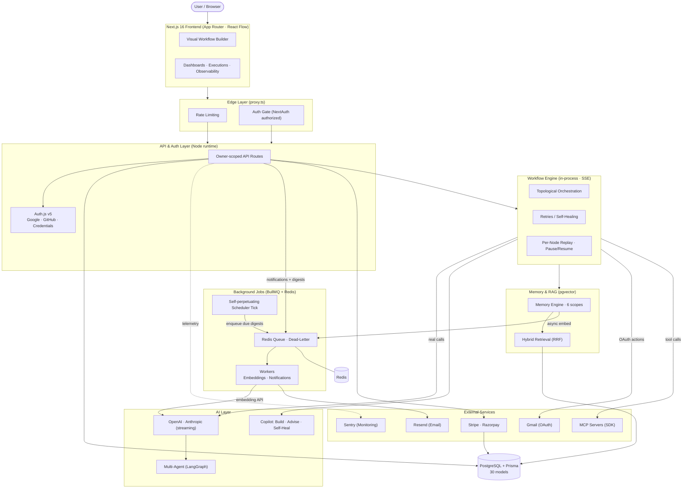

# AgentFlow AI — Architecture & Technical Decisions

This document records the major architectural decisions, trade-offs, and
reasoning behind AgentFlow AI. It captures **why** each technology and pattern
was chosen — not just *what* is used — so reviewers, senior engineers, clients,
and interviewers can understand the engineering thinking behind the platform.

Every decision below is grounded in the actual repository. Where the reasoning
is explicit in code comments or docs, it is reflected directly; where it is not
documented, it is marked **_Not documented / inferred from implementation_**.

A recurring theme across the codebase is **graceful degradation**: every
external dependency (Redis, LLM keys, embedding keys, encryption key, OAuth
providers, MCP subsystem) falls back to a synchronous, deterministic, or no-op
path instead of crashing. The app runs with zero external cost out of the box
and lights up real AI, payments, and email the moment keys are added.

---

## ADR-001 — Next.js 16 as a single-app monolith (App Router)

### Context
AgentFlow AI needs a frontend (visual workflow builder, dashboards), an API
layer (owner-scoped data access, AI, payments, MCP), real-time streaming (SSE),
and background workers — all in one codebase owned by a small team.

### Decision
Ship as a single **Next.js 16.2** application using the **App Router**,
**Turbopack**, and **React 19.2**, with `output: "standalone"` for containerized
deployment. The same image serves both the React UI and the API routes
(`app/api/**`); there is no separate backend service.

### Why This Approach?
- The App Router's React Server Components give a clean **server/client
  boundary**: server-only modules are guarded with `import "server-only"`, and
  type-only imports (`import type { ExecutionEvent }`) are erased so the
  server-only guard never fires in a client bundle. The observability hook and
  executions hook rely on this.
- Co-locating UI and API in one app removes a service boundary and a deployable
  for a small team, while `runtime = "nodejs"` route segments keep Prisma,
  BullMQ, and other Node-only deps on the server.
- `output: "standalone"` lets Next trace the import graph and emit a minimal
  `server.js` + pruned `node_modules`, which is what the production Docker image
  runs (see `next.config.ts`).
- `serverExternalPackages` externalizes `@prisma/client`, `bcryptjs`, `bullmq`,
  and `ioredis` so the bundler doesn't try to bundle Node-native packages.

### Alternatives Considered
- **Separate API service (FastAPI / Express) + SPA frontend** — rejected: doubles
  the deployables and the auth/CORS surface for a small team. *(Inferred from
  the `Dockerfile` header, which explicitly states "There is no separate FastAPI
  service in this repository.")*
- **Vercel/serverless-first deployment** — rejected as the default: in-process
  run registries and BullMQ workers assume a long-lived Node process. The code
  explicitly calls out a serverless fallback (`QUEUE_WORKER_AUTOSTART=false`,
  dedicated worker process) as an option, not the primary path.

### Trade-offs
**Advantages**
- One codebase, one deployable, one auth context, shared types end-to-end.
- Server Components minimize client JS; SSE streaming is first-class.

**Disadvantages**
- Long-lived in-process state (run registries) ties the app to a single
  process — horizontal scaling of live runs would need an external bus.
- A monolith can grow harder to split than something factored as services from
  day one.

### Current Status
✅ Implemented

### Evidence in Repository
`next.config.ts` · `tsconfig.json` · `app/` (App Router) · `instrumentation.ts` ·
`Dockerfile` (standalone, serves UI + API) · `proxy.ts`

---

## ADR-002 — TypeScript with strict mode across the stack

### Context
The platform spans visual editor code, async execution engines, AI streaming,
Prisma data, and API contracts. Type safety is needed to keep these honest as
the codebase grows.

### Decision
Use **TypeScript 5** project-wide with `"strict": true`, `"isolatedModules":
true`, and `"moduleResolution": "bundler"`. Client-safe types are split from
server-only types so the browser bundle never imports server modules.

### Why This Approach?
- `strict` catches the usual null/undefined and implicit-any classes of bugs
  that compound in a codebase mixing DB rows, AI payloads, and UI state.
- A deliberate **client/server type split** keeps server-only modules out of the
  client bundle: e.g. `lib/observability/types.ts` and `lib/executions/types.ts`
  are pure (no `server-only`, no Prisma), while the server-only
  `summary.ts`/`engine.ts` are imported type-only (erased at runtime).
- `isolatedModules` + `bundler` resolution align with Turbopack and the
  `@/*` path alias.

### Alternatives Considered
- **Plain JavaScript** — rejected: the AI/execution/Prisma boundary has too many
  shapes (event payloads, inspection payloads, memory hits) to hold without
  types. *(Inferred.)*
- **Generated types from a schema-first contract (e.g. OpenAPI/zod-to-ts)**
  — partially used: zod validates inputs at the edge (`lib/validation/`), but
  end-to-end codegen is not adopted. *(Inferred.)*

### Trade-offs
**Advantages**
- Compile-time safety across the server/client boundary; fewer runtime shape
  errors in streamed AI/execution events.
- Type-only imports let client code reference server event types safely.

**Disadvantages**
- Strict null handling requires careful mapping of nullable DB columns (e.g.
  optional inspection-payload fields on older `ExecutionStep` rows).
- No `test`/`typecheck` npm script — CI runs `npx tsc --noEmit` directly.

### Current Status
✅ Implemented

### Evidence in Repository
`tsconfig.json` · `lib/observability/types.ts` vs `lib/observability/summary.ts`
· `lib/executions/types.ts` · `lib/execution/engine.ts` (`ExecutionEvent`)

---

## ADR-003 — PostgreSQL as the primary database

### Context
The platform needs durable storage for workflows, executions, audit logs,
billing, notifications, MCP metadata, and vector embeddings — with relational
integrity and a vector index in the same store.

### Decision
Use **PostgreSQL 16** as the single primary database, modeled with Prisma. The
schema spans **30 models** across auth, billing, workflow, execution, memory,
MCP, and notifications.

### Why This Approach?
- Relational integrity across workflows → executions → steps, users →
  subscriptions → invoices, and integrations → accounts is a natural fit for a
  SQL database.
- Postgres supports **pgvector** for the embedding column, keeping semantic
  memory in the same transactional store as the rest of the data (no separate
  vector DB to synchronize).
- Prisma's PostgreSQL provider matches the team's tooling; the docker-compose
  stack ships `postgres:16-alpine` with healthchecks.

### Alternatives Considered
- **Separate vector database (Pinecone / Weaviate / Qdrant)** — rejected: the
  memory engine intentionally keeps embeddings co-located with `Memory` rows so
  recall is one parameterized SQL query (`lib/memory/repository.ts`).
  *(Inferred; reinforced by the repository's single-DB design.)*
- **MongoDB for workflow/document data** — rejected: the billing/auth/execution
  model is highly relational. *(Inferred.)*

### Trade-offs
**Advantages**
- One store, one connection, transactional joins between relational and vector
  data.
- Mature operational story (backups, replication, tooling).

**Disadvantages**
- The bundled compose image is plain `postgres:16-alpine`; the `vector(1536)`
  column requires the pgvector extension, so embeddings need the image swapped
  to `pgvector/pgvector:pg16` (or the extension installed) — documented in the
  README quick start.
- pgvector HNSW indexes are managed via raw SQL, not Prisma migrations (see
  ADR-005).

### Current Status
✅ Implemented

### Evidence in Repository
`prisma/schema.prisma` (30 models, `postgresql` provider) ·
`docker-compose.yml` / `docker-compose.prod.yml` (`postgres:16-alpine`,
healthcheck) · `lib/db.ts`

---

## ADR-004 — Prisma as the ORM and migration manager

### Context
A typed data-access layer is needed that integrates with TypeScript and
provides schema migrations, while still allowing raw SQL where Prisma can't
model a feature (vector columns, full-text indexes).

### Decision
Use **Prisma 6** with the `prisma-client-js` generator. Migrations are managed
under `prisma/migrations/` (**9 migrations**), applied via `prisma migrate
deploy`. Where Prisma can't express a feature, the code drops to parameterized
`prisma.$queryRaw` / `$executeRaw`.

### Why This Approach?
- Prisma generates a fully typed client from `schema.prisma`, so DB reads/writes
  are type-checked against the schema.
- For features Prisma can't model — the `vector(1536)` column (`Unsupported()`),
  the generated `search` tsvector column, and GIN/HNSW indexes — the code uses
  raw SQL behind a single repository. `lib/memory/repository.ts` is documented
  as "the ONLY place Prisma is read/written for the memory engine, and the ONLY
  place the embedding vector is touched."
- `prisma migrate deploy` (not `migrate dev`) is used in compose/CI for
  non-interactive, drift-safe application of pending migrations.

### Alternatives Considered
- **Drizzle / Kysely (SQL-first, lighter)** — would hand-roll more types but
  lose Prisma's migration + client generation. *(Inferred; not documented.)*
- **Raw `pg` driver everywhere** — rejected: too much boilerplate and lost type
  safety. The repo deliberately has no `pg`/`pgvector` driver package — vector
  I/O goes through `prisma.$queryRaw`.

### Trade-offs
**Advantages**
- Typed client, schema-as-source-of-truth, versioned migrations.
- Raw-SQL escape hatch keeps pgvector/tsvector reachable without abandoning
  Prisma for the relational models.

**Disadvantages**
- Schema drift risk: raw-SQL artifacts (tsvector column, indexes) aren't
  modeled by Prisma, so `prisma db push` would drop them. Migrations are
  hand-authored for those subsystems.
- The generated client is externalized in `next.config.ts` and must be
  regenerated on schema change (`npx prisma generate`).

### Current Status
✅ Implemented

### Evidence in Repository
`prisma/schema.prisma` · `prisma/migrations/` (9 dirs + `migration_lock.toml`) ·
`lib/db.ts` · `lib/memory/repository.ts` (`$queryRaw`/`$executeRaw` comment) ·
`docker-compose.yml` (`migrate` service runs `prisma migrate deploy`)

---

## ADR-005 — pgvector for semantic memory and hybrid RAG retrieval

### Context
AI agents need long-term memory: store observations, retrieve semantically
similar past context at query time, and blend semantic + keyword matching.

### Decision
Store embeddings in a **`vector(1536)`** column on the `Embedding` model using
**pgvector**, with OpenAI `text-embedding-3-small` as the embedding provider.
Retrieval is **hybrid**: pgvector cosine similarity plus a generated `search`
tsvector for full-text `ts_rank`, fused via **reciprocal rank fusion (RRF,
k=60)**.

### Why This Approach?
- Co-locating vectors with `Memory` rows keeps semantic recall as one SQL query
  (`1 - (vector <=> query)`) — no separate vector DB to keep in sync.
- Hybrid retrieval (semantic + FTS + RRF) is more robust than either alone: FTS
  catches exact-keyword memories the semantic pass misses, and the fusion
  (standard RRF constant 60) balances the two rankings.
- Embeddings are **provider-agnostic** behind an `EmbeddingProvider` seam; OpenAI
  is the only implementation today, reusing `OPENAI_API_KEY` so "a user with AI
  configured gets memory for free."
- The provider **"NEVER fakes embeddings"**: when no key is set, the engine
  no-ops cleanly — vector search simply skips unembedded memories (hybrid/FTS
  still find them).

### Alternatives Considered
- **Dedicated vector DB (Pinecone/Qdrant/Weaviate)** — rejected: adds a second
  store and synchronization; pgvector keeps memory transactional with the rest.
  *(Inferred.)*
- **Pure semantic (no FTS/hybrid)** — rejected: keyword exact matches matter for
  things like IDs and names. The code explicitly fetches "FTS-only memories so
  the fused result carries full content."
- **Local/self-hosted embedding model** — the provider seam supports this later
  without touching the engine; OpenAI was chosen for quality/availability.

### Trade-offs
**Advantages**
- Single-store, transactional, SQL-queryable semantic + keyword recall.
- Graceful no-op without an API key; pluggable embedding provider.

**Disadvantages**
- pgvector requires the extension at the DB (the default compose image lacks
  it — see ADR-003).
- Vector column and HNSW/GIN indexes are raw-SQL artifacts outside Prisma's
  typed client (`Unsupported()`), needing hand-authored migrations and the
  repository as the sole accessor.
- `attachEmbedding` relies on a unique index for idempotent `ON CONFLICT DO
  NOTHING` — a known drift item if that index isn't present.

### Current Status
✅ Implemented

### Evidence in Repository
`prisma/schema.prisma` (`Embedding` model, `Unsupported("vector(1536)")`) ·
`lib/memory/repository.ts` (cosine SQL, `attachEmbedding`, FTS) ·
`lib/memory/retrieval.ts` (`RRF_K = 60`, hybrid pipeline) ·
`lib/memory/embeddings.ts` ("never fakes", provider seam) ·
`prisma/migrations/20260714000000_memory_engine/`

---

## ADR-006 — Agent architecture: LangGraph runtime + plugin registry + MCP tool gateway

### Context
Beyond single-node AI calls, the platform needs multi-agent workflows:
specialized agents that route conditionally, run in parallel, retry, pause for
human approval, and call external tools — all observable.

### Decision
Build the multi-agent runtime on **`@langchain/langgraph`**. Agents are
registered in a **plugin registry** of `AgentDefinition`s; the runtime rebuilds
a `StateGraph` from the registry. Tools are never called directly by agents —
all tool execution flows through the **MCP runtime** gateway.

### Why This Approach?
- LangGraph provides the graph primitives the brief requires as first-class:
  **conditional routing** (reviewer → executor/planner), **parallel execution**
  (planner fans out to research/memory/reasoning), **retries** (per-node, 2 with
  backoff), **human-approval checkpoints** (`interruptBefore: ["reviewer"]` +
  resume), **loop prevention** (iteration counter + `recursionLimit`), and
  **timeouts** (wall-clock + per-LLM `AbortSignal`).
- The plugin registry makes extension additive: per `docs/multi-agent-runtime.md`,
  "Adding a new agent later = `registerAgent(...)`; the runtime rebuilds the
  graph from the registry with no runtime edits."
- **Tool isolation:** per `docs/mcp-support.md`, "The Agent Runtime never
  communicates directly with tools. All tool execution flows through the MCP
  Runtime." A per-agent memory gateway (`lib/agents/memory.ts`) enforces
  workspace isolation + declared tool permissions; the MCP tool gateway is
  "additive" — agents that don't declare `mcp.invoke` see an unused no-op
  surface.
- The runtime mirrors the execution engine's in-memory run-registry pattern and
  streams `AgentEvent`s for observability.

### Alternatives Considered
- **Hand-rolled agent loop (no LangGraph)** — rejected: re-implementing
  conditional routing, parallel fan-out, and human-in-the-loop checkpoints is
  error-prone; LangGraph is purpose-built for this.
- **Agents call tools directly** — rejected: a single tool gateway (MCP) keeps
  permissions, audit, and memory-mirroring centralized. *(Documented in
  `docs/mcp-support.md`.)*
- **LangChain agents / chains (vs. LangGraph state machine)** — LangGraph's
  state graph is a better fit for conditional + parallel + human-checkpoint
  workflows. *(Inferred.)*

### Trade-offs
**Advantages**
- First-class graph control flow (conditional, parallel, human-approval) without
  hand-rolling; additive agent registration.
- Centralized, audited, workspace-isolated tool access through one gateway.

**Disadvantages**
- Adds `@langchain/langgraph` as a dependency and a second in-memory run
  registry (single-process scale).
- The graph is rebuilt from the registry per run, which is flexible but less
  statically analyzable than a fixed graph.

### Current Status
✅ Implemented

### Evidence in Repository
`lib/agents/runtime.ts` (StateGraph, conditional/parallel/retry/checkpoint) ·
`lib/agents/memory.ts` (tool gateway, workspace isolation) · `lib/mcp/`
(tool runtime) · `docs/multi-agent-runtime.md` · `docs/mcp-support.md` ·
`package.json` (`@langchain/langgraph`)

---

## ADR-007 — Workflow execution engine: in-process, topological, SSE, with self-healing and replay

### Context
Workflows must execute node-by-node in dependency order, stream live progress
to the UI, recover from node failures, and let users inspect/replay individual
nodes — all without a separate job runner for the run itself.

### Decision
Run workflows **in-process** via an async-generator engine: topological
ordering, streamed `ExecutionEvent`s over SSE, **up to 2 retries per node**
(self-healing), **per-node replay**, pause/resume/stop, breakpoints, and step
mode. Each `ExecutionStep` persists a full inspection payload
(nodeType/config/input/output/prompt/memories). The engine is a **hybrid**: real
control flow + real AI/integration/MCP/multi-agent execution, with a simulated
action path for plain/unwired nodes.

### Why This Approach?
- An async-generator loop is the single source of truth the SSE route streams
  from, and it produces the rows persisted to `Execution` + `ExecutionStep`.
- **Self-healing:** ~6–22% of non-trigger nodes fail on first attempt and
  retries usually succeed; the engine emits `node:retry` events and persists the
  final outcome.
- **Replay** is an additive, parallel executor that re-runs one node seeded
  with its *recorded* upstream inputs "so a replay is deterministic w.r.t.
  upstream state" — the hot run loop is untouched. Real branches (memory AI,
  multi-agent, MCP/integration) re-perform the live call; the simulated branch
  streams logs and succeeds (replay is for inspecting real I/O, not re-simulating
  flakiness).
- **In-process** (not queued) keeps the run loop and its in-memory control
  handles (resume/stop) simple; the comment notes "Single-process dev server
  only — fine for this product." Background work (embeddings, notifications) is
  what goes through the queue (ADR-009).
- Plain/unwired nodes take a simulated path "appropriate for a builder product —
  n8n's UI also simulates until credentials are wired"; nodes backed by AI,
  Gmail, or MCP take real paths.

### Alternatives Considered
- **Queue-dispatched workflow execution** — rejected for the run itself: live
  SSE + resume/stop need an in-process generator. Background *jobs* (not
  workflow dispatch) are queued separately.
- **Fully simulated engine (no real calls)** — rejected: AI, Gmail, MCP, and
  multi-agent nodes take real paths; only plain nodes are simulated.
- **Temporal/Inngest-style durable workflows** — would add an external
  orchestrator; the single-process in-memory model is sufficient at current
  scale. *(Inferred.)*

### Trade-offs
**Advantages**
- Real-time SSE progress, per-node replay, pause/resume, and breakpoints with
  no external orchestrator.
- Hybrid model gives real AI/integration/MCP execution while remaining runnable
  with zero cost when no providers are wired.

**Disadvantages**
- In-memory run registry ties live runs to one process — no horizontal scaling
  of in-flight runs without an external bus.
- Plain-node actions are simulated, so a workflow with only unwired nodes
  doesn't perform real side effects (by design).

### Current Status
🟡 Partially implemented — real control flow + real AI/integration/MCP/multi-agent
execution; plain/unwired node actions are simulated by design.

### Evidence in Repository
`lib/execution/engine.ts` (topological loop, retries, run registry, "structured
simulation" header) · `lib/execution/sse.ts` (SSE encoding, `event: done`) ·
`lib/execution/replay.ts` (single-node replay) ·
`lib/execution/actions/registry.ts` (real vs simulated path) ·
`app/api/workflows/[id]/executions/[eid]/stream/route.ts`

---

## ADR-008 — Redis as the backing store for queues (and rate limiting)

### Context
Background jobs and cross-request rate limiting need fast, shared, ephemeral
state that survives across requests and workers — but only when the operator
chooses to run Redis.

### Decision
Use **Redis 7** (`redis:7-alpine` in compose) as the backing store for **BullMQ**
job queues and the optional Redis-backed rate limiter. The app fully functions
without Redis via in-process/no-op fallbacks.

### Why This Approach?
- BullMQ requires Redis for job persistence, retries, and the dead-letter queue;
  a shared store lets a dedicated worker container consume jobs produced by the
  web container.
- The Redis rate limiter uses atomic `EVALSHA` Lua scripts for accurate
  sliding-window counting across processes.
- Redis is **opt-in**: `getQueue()` returns `NoopQueueProvider` when
  `REDIS_URL` is unset, and `getRateLimiter()` falls back to in-memory. Per
  BullMQ's requirement the queue connection uses `maxRetriesPerRequest: null`
  and keeps its own connection pool separate from the cache's connection.
- BullMQ + ioredis are **lazy-imported** so importing `enqueueEmbedding()` never
  loads them until a queue is actually exercised.

### Alternatives Considered
- **No Redis (purely in-process jobs + in-memory rate limits)** — the actual
  fallback path, but loses durable jobs and cross-process rate limits in
  production. *(Documented as the graceful fallback.)*
- **Postgres-based queues (e.g. `pg-boss`)** — would avoid Redis but add
  contention to the primary DB. *(Inferred.)*
- **Memcached for caching/rate limits** — rejected: Redis covers both jobs and
  rate limiting in one dependency. *(Inferred.)*

### Trade-offs
**Advantages**
- Durable, retriable background jobs with a dead-letter queue; accurate
  cross-process rate limiting.
- Optional: the app runs without Redis, so dev/CI need no Redis.

**Disadvantages**
- An extra operational dependency (image, persistence, monitoring) in
  production.
- Per-worker connections add memory overhead at scale (BullMQ best practice:
  workers must not stall the producer's blocking commands).

### Current Status
✅ Implemented

### Evidence in Repository
`lib/queue/index.ts` (resolution order, lazy import, `maxRetriesPerRequest`) ·
`lib/rate-limit/redis.ts` (Lua `EVALSHA`) · `docker-compose.yml` /
`docker-compose.prod.yml` (`redis:7-alpine`, healthcheck) ·
`next.config.ts` (`serverExternalPackages`) · `.env.example` (`REDIS_URL`)

---

## ADR-009 — BullMQ for background job processing (embeddings + notifications)

### Context
Some work must not block the request: generating embeddings on memory write, and
delivering/digesting notifications. These need retries, concurrency, and a
dead-letter path — and must degrade gracefully when Redis is absent.

### Decision
Use **BullMQ** (on ioredis) for background jobs. Two workers start on Node
server boot via `instrumentation.ts`: a **memory-embedding** worker and a
**notification** worker (deliver + digest + self-perpetuating scheduler tick).
When Redis is unavailable, callers run the work **synchronously** as a graceful
fallback.

### Why This Approach?
- **Non-blocking memory writes:** `insertMemory()` writes the row immediately
  and enqueues embedding generation; the worker attaches the vector later. A
  memory whose embedding is still pending "simply isn't returned by vector search
  until the worker attaches its vector (hybrid/FTS still find it)." If the queue
  is down, the embedding is generated synchronously (pre-queue behavior).
- **Reliability:** jobs retry with exponential backoff; exhausted jobs move to a
  **dead-letter queue** with the failure reason. Embedding attachment is
  **idempotent** (`ON CONFLICT DO NOTHING`), so retries/duplicate jobs never
  double-insert.
- **Notifications:** the notification worker reuses the provider-agnostic
  `QueueProvider` abstraction and "NEVER touches BullMQ directly," so the same
  Redis/no-op fallback applies. A self-perpetuating "tick" heartbeat finds due
  digests and re-enqueues itself — "no external cron is required" (a
  `/api/notifications/digest/run` cron route is also available).
- **NoopQueueProvider** (`enqueue` returns `{ queued: false }`) is "identical to
  pre-queue behavior. Zero overhead" — so the queue is purely additive.

### Alternatives Considered
- **In-process `setInterval` workers only** — the fallback when Redis is absent;
  loses durability/retries across restarts.
- **External cron + stateless handlers** — used as an *option* for the scheduler
  tick (`/api/notifications/digest/run`), but the self-perpetuating worker is
  the default so no external cron is required.
- **A hosted queue service (SQS/Cloud Tasks)** — would add a cloud dependency;
  BullMQ on self-hosted Redis keeps it portable. *(Inferred.)*

### Trade-offs
**Advantages**
- Off-request embedding generation and notification delivery; durable retries +
  DLQ; idempotent reprocessing.
- Fully optional with synchronous fallback; additive, no regression to the
  memory engine (only the sync embed call is swapped for an enqueue).

**Disadvantages**
- Requires Redis + worker process in production for true async behavior.
- The same standalone server image runs in worker mode (`QUEUE_WORKER_AUTOSTART
  =true`), so the "worker" is the Next server with workers started in-process —
  a dedicated worker container is the prod recommendation.

### Current Status
✅ Implemented

### Evidence in Repository
`lib/queue/index.ts` (NoopQueueProvider, DLQ, graceful fallback) ·
`lib/queue/workers/memory-embedding.ts` (idempotent, ON CONFLICT) ·
`lib/notifications/queue.ts` (deliver/digest/tick, self-perpetuating) ·
`lib/notifications/scheduler.ts` (idempotent `digestExists`, `safeCount`) ·
`instrumentation.ts` (worker autostart) · `Dockerfile.backend` (worker image)

---

## ADR-010 — MCP (Model Context Protocol) via the official SDK for tool integration

### Context
Agents need to call external tools (filesystem, GitHub, databases, custom
servers) through a standard, swappable interface — not hardcoded adapters per
tool — with discovery, permissions, and an audit trail.

### Decision
Integrate **Model Context Protocol** using the **official
`@modelcontextprotocol/sdk`**. The repo maintains a server registry (stdio +
Streamable HTTP transports), discovers and caches tools/resources/prompts,
invokes tools with streaming progress, and enforces allow/deny permissions with
an audit trail. MCP nodes are first-class workflow nodes (`mcp.tool`,
`mcp.resource`).

### Why This Approach?
- The official SDK is the single MCP dependency; `lib/mcp/sdk-client.ts` is
  documented as "The ONLY module that imports the SDK Client," so SDK
  swaps/upgrades are edits in one place.
- A real client does the handshake (`initialize`, itself abortable), paginated
  `listTools`/`listResources`/`listPrompts`, and `callTool` with progress
  notifications, `AbortSignal`, and `resetTimeoutOnProgress` for long-running
  calls. Tool errors return `isError: true` rather than throwing (transport/
  cancellation errors still throw).
- **Permissions are deny-first:** a name is rejected if it matches any deny
  pattern, otherwise it must match an allow pattern (empty allow = allow all),
  with `*` wildcard support — "the same spirit as the agent tool-permission
  check."
- **Every invocation is audited + mirrored to memory:** a `McpInvocation` row
  (durable audit) plus a `remember()` call so tool usage becomes recallable
  memory. "The Memory Engine is NEVER bypassed" and no-ops cleanly when
  embeddings are unconfigured; memory write failures are swallowed (memory is
  recall, not on the tool-call critical path).
- The execution engine routes `mcp.tool`/`mcp.resource` nodes through the MCP
  gateway "so engine.ts keeps draining runAction generically with no change."

### Alternatives Considered
- **Hand-rolled per-tool adapters** — rejected: doesn't scale to arbitrary
  external servers and loses a standard protocol.
- **A custom tool-calling protocol (non-MCP)** — rejected: MCP is an emerging
  standard; the official SDK keeps the platform interoperable with third-party
  MCP servers.
- **LangChain tools (instead of MCP)** — the runtime uses LangGraph for agent
  orchestration but routes tool execution through MCP, keeping tools
  agent-agnostic. *(Inferred; `docs/mcp-support.md` documents the separation.)*

### Trade-offs
**Advantages**
- Standard, swappable tool protocol; one SDK client module to maintain;
  discovered tools/resources cached and permissioned.
- Tool usage becomes audited + recallable memory through the same engine.

**Disadvantages**
- Adds the MCP SDK dependency and an external-server trust/permissions surface.
- MCP subsystem tables are newer; the scheduler uses `safeCount` to avoid
  breaking digests if the `McpInvocation` table isn't migrated yet.

### Current Status
✅ Implemented

### Evidence in Repository
`lib/mcp/sdk-client.ts` (SDK wrapper, handshake, pagination, callTool) ·
`lib/mcp/permissions.ts` (deny-first allow/deny) · `lib/mcp/audit.ts`
(invocation + memory mirror) · `lib/mcp/transports/` (stdio + HTTP) ·
`lib/execution/actions/registry.ts` (mcp routing) · `docs/mcp-support.md` ·
`package.json` (`@modelcontextprotocol/sdk`)

---

## ADR-011 — AI provider abstraction: direct-fetch streaming + deterministic fallback

### Context
The platform must call LLMs for AI nodes, the Copilot, and multi-agent runs —
across providers (OpenAI, Anthropic) — and still run with zero cost when no key
is configured.

### Decision
A pluggable **AI provider** that streams from the real model over **`fetch` +
SSE** (no SDK) when `OPENAI_API_KEY` or `ANTHROPIC_API_KEY` is set, and delegates
to an **enhanced deterministic engine** otherwise. The same seam backs the
Copilot and the agent LLM closures. Both paths are real product behavior —
"never a mock."

### Why This Approach?
- **No SDK by choice:** `lib/ai/provider.ts` calls the OpenAI/Anthropic REST APIs
  directly with `fetch`, which "keeps this module dependency-free and hermetic
  to install." The embeddings module mirrors this philosophy ("via fetch (no
  SDK — matches lib/ai/provider.ts philosophy)").
- **Same UX either way:** "Mirrors the Stripe 'configured vs dev-fallback'
  pattern." When configured, real streaming tokens; when not, the deterministic
  fallback — both are real paths.
- **Token estimation from character count (~4 chars/token)** since streaming
  responses don't return usage — good enough for observability without a
  tokenizer dependency.
- On a real call failure, the provider logs and falls back explicitly
  (`completeText failed, falling back`).

### Alternatives Considered
- **Official OpenAI/Anthropic SDKs** — rejected: adds dependency weight and
  install friction; direct fetch keeps the module hermetic.
- **Single hard-coded provider** — rejected: the seam allows OpenAI *and*
  Anthropic behind one interface; embeddings are similarly provider-agnostic.
- **Mock-only / canned responses when unconfigured** — rejected: the fallback
  is a real deterministic engine, not fake data.

### Trade-offs
**Advantages**
- Zero SDK dependencies; streaming works for both providers; zero-cost dev with
  a real fallback.
- Adding a provider = one `streamX` function behind the seam.

**Disadvantages**
- **Partial provider coverage:** OpenAI and Anthropic are callable; **Gemini
  appears only as a cost/latency descriptor** (`lib/ai/optimizer/providers.ts`)
  — there is no `streamGemini`, so the `ai.gemini` palette node falls through to
  the simulated path. The local-LLM node is likewise not wired to a live server.
- Hand-maintained REST/SSE parsing instead of a maintained SDK client.

### Current Status
🟡 Partially implemented — OpenAI + Anthropic callable; Gemini is cost-estimation
only (not a live provider).

### Evidence in Repository
`lib/ai/provider.ts` (`streamOpenAI`/`streamAnthropic`, "no SDK", fallback) ·
`lib/memory/embeddings.ts` (no-SDK embedding) · `lib/agents/llm.ts` ·
`lib/ai/optimizer/providers.ts` (Gemini availability/cost only)

---

## ADR-012 — Memory architecture: owner-scoped, six scopes, contentHash dedup, async embedding

### Context
Agents need structured long-term memory that is isolated per user/workspace,
deduplicated, retrievable by semantics + keywords, and observable — without
blocking writes on embedding API calls.

### Decision
A **Memory Engine** with **six scopes** (`short_term`, `conversation`,
`long_term`, `workflow`, `agent`, `workspace`), owner-scoped reads/writes,
**SHA-256 contentHash** dedup per `(ownerId, scope)`, optional **collections**,
merging, and expiry, plus `MemoryEvent` observability rows. Embeddings are
generated **asynchronously** via the queue and attached idempotently.

### Why This Approach?
- **Owner isolation:** every query filters by `ownerId`; `workspace` scope adds
  `orgId` for org-shared memory. The repository is "the ONLY place Prisma is
  read/written for the memory engine."
- **Dedup:** SHA-256 of normalized content is the dedup key per (owner, scope),
  preventing duplicate memories from repeated runs.
- **Non-blocking writes:** the memory row is written immediately; embedding
  generation is enqueued and attached later by the worker (`ON CONFLICT DO
  NOTHING` idempotency). This is "the ONLY change to the Memory Engine" —
  recall/manage are untouched.
- **Recall is hybrid + cached:** an in-process LRU cache keyed by
  `hash(query+scope+filters)` with a short TTL makes repeated retrievals within a
  run cheap; results carry content + score, never the vector.
- **Engineered to no-op:** when embeddings are unconfigured, the engine logs
  "memory disabled — embeddings not configured" and the node still generates a
  real response — it "never fakes embeddings."

### Alternatives Considered
- **Synchronous embedding on write** — the pre-queue behavior; rejected as
  default because it blocks writes on a slow external API. Kept as the fallback.
- **A single global scope** — rejected: six scopes give meaningful isolation
  (conversation vs long-term vs workflow vs workspace).
- **No dedup (append-only)** — rejected: repeated runs would flood memory with
  duplicate content.

### Trade-offs
**Advantages**
- Writes never block on embedding latency; idempotent reprocessing; hybrid +
  cached recall; clean no-op without a key.
- Clear isolation model (owner + six scopes + workspace org-sharing).

**Disadvantages**
- A just-written memory isn't in vector search until the worker attaches its
  embedding (hybrid/FTS still find it immediately).
- Six scopes add UX complexity; the `MemoryEvent`/collection/expiry features are
  modeled but not all surfaced in the UI yet.

### Current Status
✅ Implemented

### Evidence in Repository
`lib/memory/types.ts` (six scopes) · `lib/memory/repository.ts` (sole accessor,
contentHash, async embed, hybrid SQL) · `lib/memory/retrieval.ts` (RRF, LRU
cache) · `lib/memory/embeddings.ts` (provider seam, "never fakes") ·
`lib/queue/workers/memory-embedding.ts` (idempotent attach)

---

## ADR-013 — Authentication & authorization: Auth.js v5, JWT sessions, owner-scoped APIs, proxy gate

### Context
The app needs OAuth + password login, a server-side session, route protection
for the `(app)` group, and per-user data isolation on every API call.

### Decision
Use **Auth.js v5** (`next-auth` + `@auth/prisma-adapter`) with **Google,
GitHub, and email+password** providers, a **JWT session** (7-day maxAge,
refreshed daily), **bcryptjs** password hashing (cost 12), and an
**owner-scoped `apiUser()` helper** for route handlers. Route protection runs in
**`proxy.ts`** (Next.js 16's middleware replacement).

### Why This Approach?
- **Edge-safe split:** `auth.config.ts` is edge-safe (no Prisma import) so it
  can run in the proxy; the full `auth.ts` wires the Prisma adapter server-side.
  OAuth providers "only register their metadata here … we only instantiate a
  provider if its env vars are present, so missing OAuth doesn't crash boot."
- **The `apiUser()` pattern** gives every route handler a clean 401 for
  no-session and a 500 (cause logged) for DB errors "instead of every route
  re-implementing the try/catch." All data queries then filter by the session
  user's `id`.
- **`proxy.ts`** routes `/api/*` to rate-limiting only (auth handled per-route by
  NextAuth handlers) and page routes to NextAuth's `authorized` callback, which
  redirects unauthenticated users away from the `(app)` group to sign-in.
- **JWT carries the AgentFlow session shape** (role, `orgId`,
  `stripeCustomerId`); `orgId` is hydrated from the user's first/owner
  membership. Sign-in events are written to the **AuditLog** best-effort ("Never
  blocks the sign-in").

### Alternatives Considered
- **Database sessions (not JWT)** — JWT keeps the proxy edge-gate stateless and
  avoids a DB read per request. *(Inferred.)*
- **A third-party auth provider (Clerk/Auth0)** — rejected: Auth.js + Prisma
  adapter keeps auth in-app and typed, with no external auth vendor.
- **Cookie-only gate without a typed helper** — rejected: `apiUser()` standardizes
  401/500 handling and owner scoping.

### Trade-offs
**Advantages**
- In-app, typed, no auth vendor; edge-safe config + server-only adapter;
  standardized owner-scoped route auth.
- Passwords hashed with bcrypt (cost 12); OAuth conditional on env vars.

**Disadvantages**
- **No 2FA/MFA** is implemented (no TOTP/`twoFactor` fields in the schema).
- **Isolation is owner-based (`ownerId`), not org-based:** `orgId` exists on the
  schema + session token but reads filter by `ownerId`; true org-level sharing is
  modeled but not the primary isolation boundary.
- Credentials re-validate with zod inside `authorize` (good), but zod coverage
  across all API routes is partial.

### Current Status
🟡 Partially implemented — auth, sessions, owner-scoping, and audit-on-sign-in
are real; no 2FA; org-scoping exists in the model but reads use `ownerId`.

### Evidence in Repository
`auth.ts` (Auth.js v5, Prisma adapter, JWT, audit on signIn) · `auth.config.ts`
(edge-safe, providers, `authorized` callback) · `proxy.ts` (rate-limit + auth
gate) · `lib/auth/api.ts` (`apiUser`) · `lib/auth/password.ts` (bcrypt cost 12)

---

## ADR-014 — Security: encryption, rate limiting, validation, monitoring, permissions

### Context
Secrets (OAuth tokens) must be protected at rest; public API endpoints need
abuse protection; inputs need validation; errors need safe capture; and tool
calls need permission control.

### Decision
- **OAuth tokens encrypted at rest** with **AES-256-GCM** (`lib/integrations/crypto.ts`),
  stored as `{iv, ct, tag}` ciphertext on `IntegrationAccount`; the repository is
  the only caller and decrypts only into an in-memory shape never serialized to
  a response.
- **Rate limiting** via a provider-agnostic library (`sliding`/`fixed`/`token`
  algorithms) with in-memory + Redis backends, enforced at the **edge in
  `proxy.ts`**; named policies (auth 5/60s, ai 30/60s, workflow 20/60s, memory
  60/60s, mcp 60/60s, public 100/60s); fails open on limiter error.
- **Input validation** with **zod** schemas (`lib/validation/`): auth flows
  (password rules: min 12, max 128, letter+number) and notifications routes;
  `safeParse` inline (no shared generic helper).
- **Monitoring/error tracking** with **Sentry** (lazy, conditional on
  `SENTRY_DSN`), `sendDefaultPii: false`, a `beforeSend` PII scrubber, and
  GlobalHandlers disabled (the app's own `initMonitoring` owns
  uncaughtException/unhandledRejection to avoid double-capture).
- **MCP permissions** deny-first allow/deny lists + per-invocation audit.

### Why This Approach?
- AES-256-GCM (96-bit IV, GCM auth tag) is the standard for authenticated
  encryption; the key is cached per-process keyed by the env value and "must
  never reach the client."
- Rate limiting at the edge protects every `/api/*` route cross-cuttingly
  without modifying each route; exemptions for webhooks/callbacks and
  auth/session/csrf (which `useSession` polls on focus, so the 5/60s budget would
  trip).
- Sentry is lazy-imported so the bundle pays nothing when the DSN is unset;
  PII scrubbing is a single `beforeSend` chokepoint.
- Deny-first MCP permissions mirror the agent tool-permission check.

### Alternatives Considered
- **Env-only secrets (no encryption at rest)** — rejected for OAuth tokens:
  tokens need to be used, so they're encrypted with a key from env.
- **Per-route rate-limit middleware** — rejected: would require modifying every
  route; the edge proxy is cross-cutting.
- **Eager Sentry init** — rejected: lazy import keeps it free when disabled.

### Trade-offs
**Advantages**
- Tokens encrypted at rest; edge rate limiting with Redis accuracy + in-memory
  fallback; PII-scrubbed error tracking; deny-first tool permissions.

**Disadvantages**
- The in-app **Secrets Manager and API Keys UI tabs are stubs** (hardcoded
  data, no `/api/secrets` route, no `Secret` model) — generic secret storage is
  env-only in practice; only OAuth tokens are encrypted at rest.
- **Audit logging is minimal** — only `user.signed_up` / `user.signed_in` are
  written; no sign-out, run, integration, or admin events are audited.
- zod validation is **partial** (auth + notifications); no shared validation
  helper; no 2FA.

### Current Status
🟡 Partially implemented — encryption, rate limiting, Sentry, MCP permissions
real; Secrets Manager UI stubbed; audit logging minimal; no 2FA.

### Evidence in Repository
`lib/integrations/crypto.ts` (AES-256-GCM) · `lib/rate-limit/` (lib + policies)
· `proxy.ts` (edge enforcement) · `lib/validation/` (zod) ·
`lib/monitoring/sentry.ts` (lazy init, scrub, GlobalHandlers off) ·
`lib/mcp/permissions.ts` + `lib/mcp/audit.ts` · `app/(app)/settings/page.tsx`
(stubbed secrets UI)

---

## ADR-015 — Notifications: Resend email + BullMQ digests with synchronous fallback

### Context
Users need email notifications for billing, security, workflow, and integration
events, plus hourly/daily/weekly digests — without blocking requests, and
working even when Redis is absent.

### Decision
A notification engine with **Resend** for email delivery, a **BullMQ** queue for
deliveries + digests, a **self-perpetuating scheduler tick** (15-min heartbeat)
that finds due digests and re-enqueues itself, real **templates** across
event types, and **preferences + delivery tracking** models. When Redis is
absent, deliveries run synchronously; the scheduler can also be driven by a
cron route.

### Why This Approach?
- The notification module "NEVER touches BullMQ directly" — it reuses the
  provider-agnostic `QueueProvider`, so the same Redis/no-op fallback applies
  ("when Redis is absent, deliveries run synchronously as a graceful fallback").
- The **self-perpetuating tick** means "no external cron is required — although
  `/api/notifications/digest/run` can also drive it on a hosted cron." The
  scheduler is **idempotent** (`digestExists` guards duplicates), and only runs
  daily near the top of a day / weekly on Mondays to keep query volume down.
- **Resend** is real: `lib/resend.ts` instantiates a real `Resend` client when
  `RESEND_API_KEY` is set and calls `resend.emails.send(...)`; bounce/suppression
  classification is real. Without the key, rendered emails fall back to
  `tmp/emails/*.json` for dev.
- `safeCount` returns 0 if an optional table (e.g. `McpInvocation`) is absent,
  so "a missing optional subsystem never breaks digest generation."

### Alternatives Considered
- **External cron only (no self-perpetuating worker)** — available as an option
  (the cron route), but the worker tick removes the external dependency.
- **Synchronous email on every event** — the fallback when Redis is absent;
  rejected as default because it blocks requests on email latency.
- **A dedicated email vendor SDK beyond Resend** — the provider seam allows
  swaps; Resend was chosen for developer experience. *(Inferred.)*

### Trade-offs
**Advantages**
- Non-blocking delivery + digests; idempotent scheduling; works with or without
  Redis; real bounce/suppression handling.

**Disadvantages**
- True async requires Redis + the worker process; otherwise email is sent
  synchronously in-request.
- Digest timing depends on the tick heartbeat (15-min granularity) unless an
  external cron drives it.

### Current Status
✅ Implemented

### Evidence in Repository
`lib/notifications/queue.ts` (deliver/digest/tick, self-perpetuating) ·
`lib/notifications/scheduler.ts` (idempotent, `safeCount`) ·
`lib/resend.ts` (Resend client) · `lib/notifications/templates/` ·
`app/api/notifications/` · `prisma/schema.prisma` (Notification* models)

---

## ADR-016 — Real-time dashboard & in-flight runs: polling + per-run SSE

### Context
Dashboards, the executions list, and observability need near-real-time updates
without the complexity/cost of WebSockets for every screen, while an open run
should animate its steps live.

### Decision
- **Polling** for aggregate views: the dashboard + health at **30s**; the
  executions list and observability at **10s** plus a **`visibilitychange`
  focus refresh**.
- **Per-run SSE** (native `EventSource`) for in-flight execution/agent runs —
  the list/observability pages open an `EventSource` to the per-execution stream
  route for each in-flight run, and the execution detail page streams its own
  run live.

### Why This Approach?
- A list "only needs to reflect that a run is 'running' and flip it to
  succeeded/failed within ~10s; the per-step live animation lives on the detail
  page" — so 10s polling is the right granularity for lists (documented in the
  hook header).
- `visibilitychange` refetch on focus keeps data fresh when the user returns
  without re-polling in a backgrounded tab.
- SSE (not WebSockets) for live runs: unidirectional server→client streaming is
  enough, reuses the execution engine's async generator, and auto-reconnects via
  `EventSource`; a terminal `event: done` lets the client close cleanly. SSE
  routes set `X-Accel-Buffering: no` to flush events through proxies.
- Health checks expose `/api/health/{live,ready,details}`; readiness probes seven
  providers in parallel (Postgres is the only critical one) with a 503 only when
  Postgres is unhealthy.

### Alternatives Considered
- **WebSockets for all live data** — rejected: unidirectional SSE is simpler and
  sufficient; polling suffices for aggregates.
- **Server push for lists (no polling)** — rejected: 10s polling is cheap and
  avoids per-client stream state for lists.
- **Shorter intervals (1–2s)** — rejected: would multiply DB load for marginal
  freshness on aggregate views. *(Inferred.)*

### Trade-offs
**Advantages**
- Simple, robust freshness with no socket infrastructure; per-run live
  animation exactly where it matters; cheap polling for aggregates.

**Disadvantages**
- Up to ~10s (lists) / ~30s (dashboard) staleness for aggregate views.
- The dashboard/health hook has no `visibilitychange` focus refresh (the 10s
  hooks do) — *Not documented / inferred from implementation.*

### Current Status
✅ Implemented

### Evidence in Repository
`lib/hooks/use-dashboard.ts` (30s) · `lib/executions/use-executions.ts` (10s +
focus, header rationale) · `lib/observability/use-observability.ts` (10s +
focus) · `lib/execution/sse.ts` (`sseStream`, `event: done`) ·
`app/api/workflows/[id]/executions/[eid]/stream/route.ts` ·
`app/api/health/{live,ready,details}/route.ts`

---

## ADR-017 — Observability: DB-backed aggregation, nearest-rank percentiles, health, and Sentry

### Context
Operators need latency (p50/p99), cost, success rate, retries, AI-node
distribution, trends, recent + in-flight runs, prompt versions, and an audit
log — derived from real data, not mocked.

### Decision
A server-only `getObservabilitySummary()` runs one **owner-scoped** pass over
`Execution`/`ExecutionStep`/`Workflow`/`WorkflowVersion`/`AuditLog` (plus an
optional MCP fold-in) with all queries in parallel. p50/p99 are
**nearest-rank** over the last 1000 finished executions; the 14-day trend is
JS-bucketed from a capped rowset. Health probes run seven providers in
parallel; **Sentry** captures errors (lazy, conditional, PII-scrubbed).

### Why This Approach?
- "Prisma has no percentile aggregate, so p50/p99 are nearest-rank over the last
  1000 finished executions (capped)." The capped-rowset + JS-bucket approach
  "matches the product's current single-process scale."
- The page "never touches `@/lib/mock/data`" — all KPIs/trends/distributions are
  derived from real tables.
- A **fixed palette** for known AI node types with a rotated fallback "keeps
  the donut stable across renders."
- The MCP fold-in "never breaks the rest on throw."
- Health: `liveness` is always 200 (cheap restart probe); `readiness` returns 503
  only when Postgres (the sole critical dep) is unhealthy, 200 for
  healthy/degraded.

### Alternatives Considered
- **Percentile via SQL percentile_cont** — would need a custom query;
  nearest-rank over a capped set is simpler and documented as sufficient.
- **Time-series DB (Prometheus/Influx)** — rejected at current scale: deriving
  from the transactional DB keeps one source of truth. *(Inferred.)*
- **Eager Sentry** — rejected: lazy + conditional keeps it free when disabled.

### Trade-offs
**Advantages**
- Real, owner-scoped observability with no mock data; cheap nearest-rank
  percentiles; parallel health probes; safe error capture.

**Disadvantages**
- **Audit-log coverage is minimal** — only sign-in/sign-up events are written
  (`auth.ts events.signIn`); run/integration/admin events aren't audited.
- p50/p99 are approximate (nearest-rank over a capped 1000-row window), not
  exact.
- Trend bucketing is JS-side (capped), not a DB aggregate.

### Current Status
✅ Implemented (audit-write coverage is minimal — see ADR-014)

### Evidence in Repository
`lib/observability/summary.ts` (nearest-rank, capped rows, single-process) ·
`app/api/observability/route.ts` · `lib/health/` (parallel providers) ·
`app/api/health/{live,ready,details}/route.ts` · `lib/monitoring/sentry.ts` ·
`auth.ts` (`events.signIn` audit)

---

## ADR-018 — Payments & credits: dual Stripe/Razorpay facade with metered credits

### Context
The platform must charge for paid plans, handle subscriptions, and meter usage
by credits — across regions (USD/INR) and more than one payment provider.

### Decision
A **provider-agnostic payments facade** (`lib/payments`) selects the active
provider by `PAYMENT_PROVIDER` (**default `razorpay`**), with **Stripe**
available behind the same interface when set to `stripe`. Real checkout
sessions, a customer portal, signature-verified webhooks, and subscription
lifecycle are implemented for both. **Self-serve plans are Pro and Business**;
**Free and Enterprise are conceptual** (credit allotments, no checkout page).
Credits are metered per plan via a `Usage` model and `PLAN_CREDIT_LIMIT`.

### Why This Approach?
- "The rest of the app imports only from `@/lib/payments` and never references a
  specific provider" — so the billing UI, webhook routes, and metering stay
  provider-agnostic.
- `lib/payments/plans.ts` is "the canonical home for PlanId/Interval/PLAN_META —
  both providers and the billing UI import from here so pricing stays in sync
  with what each provider charges." `priceAmount` (whole major units) is the
  source of truth (Pro $29/mo / $24 yearly; Business $99/mo / $82 yearly).
- Currency-aware: `planAmountMinor` converts to the smallest unit (cents for
  USD, paise for INR); the comment notes INR amounts must be set in `PLAN_META`
  before enabling `RAZORPAY_CURRENCY=inr`.
- Webhooks are **signature-verified** (`stripe.webhooks.constructEvent`,
  Razorpay webhook secret) and dispatch the subscription lifecycle events.
- Credits: `PLAN_CREDIT_LIMIT` numerics drive metering/remaining-credit math
  (dashboard, billing); the `Usage` model tracks consumption.

### Alternatives Considered
- **Stripe only** — rejected: Razorpay is the default to better serve INR/India
  customers; both are kept behind one interface.
- **Single hard-coded provider (no facade)** — rejected: the facade makes the
  provider swappable without touching the billing UI or metering.
- **Flat-rate pricing (no credits)** — rejected: credit metering aligns cost
  with AI/execution usage.

### Trade-offs
**Advantages**
- One interface, two real providers, currency-aware amounts; signature-verified
  webhooks; metered credits keep pricing in sync across providers.

**Disadvantages**
- **Free and Enterprise have no self-serve checkout** (no `PLAN_META` entry) —
  they're conceptual tiers with credit allotments only.
- Stripe is opt-in (default is Razorpay); operators must set `PAYMENT_PROVIDER=
  stripe` and the Stripe env keys.
- INR pricing needs `PLAN_META` amounts adjusted before enabling INR billing.

### Current Status
✅ Implemented (Pro + Business self-serve; Free + Enterprise conceptual)

### Evidence in Repository
`lib/payments/index.ts` (facade, default razorpay) · `lib/payments/plans.ts`
(plan/credit source of truth) · `lib/payments/providers/stripe.ts` (checkout,
portal, webhooks) · `app/api/payments/` (checkout/webhook/subscription) ·
`lib/usage.ts` · `prisma/schema.prisma` (`Subscription`, `Invoice`, `Usage`,
`PlanPrice`)

---

## ADR-019 — CI/CD: GitHub Actions (lint, typecheck, build, docker) + GHCR release

### Context
Changes need automated validation before merge — type safety, lint, a clean
build, schema validity, and a buildable container image — plus a path to
publish images on release, without a test framework that doesn't exist.

### Decision
A **GitHub Actions CI** workflow (`.github/workflows/ci.yml`) runs on push/PR
to `master` with jobs: **lint-typecheck** (`tsc --noEmit` on the full repo +
ESLint on **changed files only** + `prisma generate`), **build** (`prisma
validate` + `prisma generate` + `next build`), **test** (`npm test --if-present`
— currently a no-op), **security** (`npm audit --audit-level=high`, non-blocking),
**dependency-review** (PRs, fail-on high), **docker** (build both Dockerfiles, no
push), and **e2e** (skipped — no Playwright config). A separate **release**
workflow (`.github/workflows/release.yml`) builds + pushes both images to **GHCR**
on `v*` tags and creates a GitHub release.

### Why This Approach?
- **Quality gates hard-fail:** `tsc` (full repo), ESLint-on-changed-files,
  `prisma validate`, `next build`, and docker build; "unit/e2e/security do not
  hard-fail when their tooling is absent."
- **ESLint on changed files only** is explicit: the repo has pre-existing lint
  errors in protected modules (payments, resend) the workflow "is not permitted
  to modify," so enforcement targets new/changed code while `tsc` is enforced
  repo-wide (currently clean).
- Build-time env is injected (`DATABASE_URL`, `AUTH_SECRET`) so module-level
  env reads don't crash the build with no real DB/auth.
- The **release** workflow uses `docker/metadata-action` for semver tags +
  `latest` + git SHA, GHA cache, and `generate_release_notes` on the GitHub
  release.

### Alternatives Considered
- **Jenkins** — not used; no `Jenkinsfile` exists. GitHub Actions keeps CI with
  the repo.
- **ESLint on the full repo (fail on pre-existing errors)** — rejected: would
  block all PRs on legacy modules.
- **Hard-failing `npm audit`** — rejected (non-blocking) to avoid blocking on
  transitive advisities; the PR-time `dependency-review` action is the gate.

### Trade-offs
**Advantages**
- Type safety + clean build + schema validity + image buildability enforced on
  every PR; no PaaS lock-in (GHCR images + compose).
- Changed-file ESLint avoids blocking on legacy debt while `tsc` stays strict.

**Disadvantages**
- **No test framework and no tests exist** — the `test` and `e2e` jobs are no-ops
  (`npm test --if-present`; no Playwright config). There is no `test` or
  `typecheck` npm script.
- CI does not deploy — release only publishes images; deployment is manual via
  compose.
- Security audit is non-blocking (advisory).

### Current Status
🟡 Partially implemented — CI build/lint/typecheck/docker/release are real; no
automated test suite exists.

### Evidence in Repository
`.github/workflows/ci.yml` (jobs, quality-gate comment, changed-file ESLint) ·
`.github/workflows/release.yml` (GHCR push, GitHub release) · `package.json`
(only `dev`/`build`/`start`/`lint` scripts; no `test`)

---

## ADR-020 — Deployment: Docker standalone images (web + worker) + compose, no PaaS lock-in

### Context
The app should be deployable on any host that runs containers, with a
production topology that separates the web server from the background worker,
and health-checked Postgres + Redis.

### Decision
Ship two multi-stage **Dockerfiles**: `Dockerfile` (web, `output: "standalone"`,
serves UI + API, non-root, healthcheck on `/api/health/live`) and
`Dockerfile.backend` (worker — same standalone image with
`QUEUE_WORKER_AUTOSTART=true` so `instrumentation.ts` starts the embedding +
notification workers). **`docker-compose.yml`** (dev: bind-mount HMR, in-process
worker) and **`docker-compose.prod.yml`** (prod: standalone images,
`restart: always`, dedicated worker container, resource limits, required `.env`)
define the topology. No Vercel/Render/AWS config is present — deployment is
container-based.

### Why This Approach?
- The `Dockerfile` header is explicit: "AgentFlow AI is a Next.js monolith: this
  image serves BOTH the React UI and the API routes … The 'backend' Dockerfile
  containerizes the BullMQ background worker instead."
- `output: "standalone"` produces a minimal `server.js` + pruned `node_modules`,
  keeping the image small; `serverExternalPackages` ensures Prisma/bcrypt/BullMQ
  aren't bundled.
- Prod separates web (no worker autostart — "the dedicated worker service runs
  the BullMQ worker") from the worker (autostart true), each with healthchecks
  and resource limits; migrations run via a one-shot `migrate` service
  (`prisma migrate deploy`).
- Dev compose runs the worker in-process inside the web container (profile-gated
  dedicated worker available); prod requires a `.env` with at least
  `AUTH_SECRET` and provider keys.
- No PaaS config keeps the app portable; the same images are published to GHCR by
  the release workflow.

### Alternatives Considered
- **Vercel / serverless deployment** — not the default: in-process run registries
  + BullMQ workers assume a long-lived process. The code documents a serverless
  fallback (dedicated worker process + cron route) but compose/Docker is primary.
- **A single combined container (web + worker in-process)** — the dev default;
  prod separates them for independent scaling/restart of background work.
- **Render/Heroku/Elastic Beanstalk config** — not present; container + compose
  avoids platform lock-in.

### Trade-offs
**Advantages**
- Portable, PaaS-free container deployment; web/worker separation in prod;
  healthchecked Postgres + Redis; small standalone images.

**Disadvantages**
- Operators must run their own Docker host + Postgres (+ pgvector for
  embeddings) + Redis — no one-click PaaS.
- The "worker" image is the same Next standalone server with workers started
  in-process (via `instrumentation.ts`), not a dedicated minimal binary.
- No cloud-specific IaC (Terraform/CDK) is included.

### Current Status
✅ Implemented

### Evidence in Repository
`Dockerfile` (standalone, non-root, healthcheck) · `Dockerfile.backend` (worker,
autostart) · `docker-compose.yml` (dev) · `docker-compose.prod.yml` (prod,
dedicated worker, required `.env`) · `next.config.ts` (`output: "standalone"`)
· `instrumentation.ts` (worker autostart) · `.github/workflows/release.yml`
(GHCR publish)

---

# System Architecture

AgentFlow AI is a **Next.js 16 monolith**: one app serves the React UI, the API
routes, and (in the same process) the workflow execution engine and the BullMQ
workers. Postgres is the single source of truth (relational + vector data);
Redis backs the job queue and rate limiter; external AI providers, Gmail, and
MCP servers are called from the engine; Resend, Stripe/Razorpay, and Sentry are
integrated through provider seams.

**Request flow:** the browser hits React Server Components / client pages which
call owner-scoped **API routes** authenticated by Auth.js v5 (`proxy.ts` gates
page routes; `apiUser()` guards APIs). Running a workflow drives the
**in-process execution engine** over SSE — nodes run in topological order with
retries/self-healing; AI nodes call OpenAI/Anthropic (or the deterministic
fallback), `ai.multiAgent` runs the LangGraph runtime, memory-enabled nodes
read/write the pgvector memory engine, and Gmail/MCP nodes call external
services. Each step persists a full inspection payload.

**Background flow:** memory embedding generation and notification
delivery/digests are enqueued to **BullMQ (Redis)** and processed by workers
started on boot via `instrumentation.ts`; if Redis is absent, callers run the
work synchronously. A self-perpetuating scheduler tick drives digests without
external cron.

**Cross-cutting:** a `proxy.ts` edge layer rate-limits `/api/*`; Sentry (lazy,
PII-scrubbed) captures errors; health endpoints (`/api/health/{live,ready}`)
feed container and compose healthchecks; payments flow through the
Stripe/Razorpay facade with signature-verified webhooks and metered credits.

**Legend / notes:**
- Workflow **execution** is in-process (SSE generator + in-memory run registry);
  the **queue** carries only background jobs (embeddings, notifications), not
  workflow dispatch.
- Every external dependency has a graceful fallback: no LLM key → deterministic
  fallback; no embedding key → memory no-ops; no Redis → synchronous jobs +
  in-memory rate limits; no `SENTRY_DSN` → Noop monitoring.
- Isolation is **owner-based** (`ownerId`) on all API queries; `orgId` is
  carried on the session token and modeled in the schema but reads filter by
  `ownerId`.