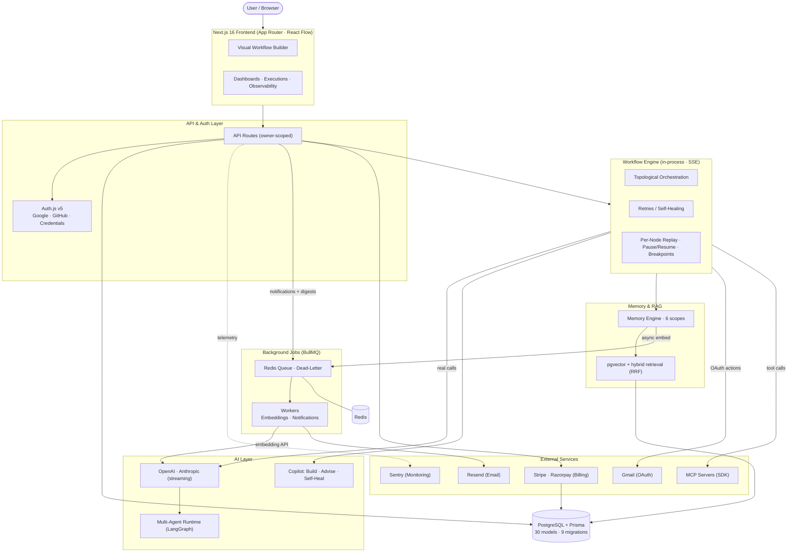

<p align="center">
  
</p>

<h1 align="center">AgentFlow AI</h1>

<p align="center">
  <strong>The AI-Native Automation Platform.</strong><br />
  Workflows that <em>think, plan, reason, remember, and self-heal</em> — orchestrated by autonomous agents with real tool-calling, persistent memory, and live observability.
</p>

<p align="center">
  <a href="https://github.com/zaydhassan/AgentFlowAI/actions/workflows/ci.yml"></a>
  <a href="https://github.com/zaydhassan/AgentFlowAI"></a>
  <a href="https://github.com/zaydhassan/AgentFlowAI/blob/master/LICENSE"></a>
  <a href="https://nextjs.org"></a>
  <a href="https://www.typescriptlang.org"></a>
  <a href="https://www.prisma.io"></a>
  <a href="https://www.postgresql.org"></a>
</p>

<p align="center">
  
</p>

---

## What is AgentFlow AI?

AgentFlow AI is a **production-grade, AI-native automation platform** where AI is
the engine rather than a bolt-on. Every workflow runs inside a real execution
runtime that reasons over each step, stores long-term memory, recovers from
failures automatically, and streams its progress live to the dashboard.

It ships as a fully runnable Next.js 16 app — a premium dark / glassmorphism
design system, a React Flow visual builder, a real workflow engine with SSE
streaming, pgvector-backed memory & RAG, an MCP tool-calling client, and a
dual-provider billing system. When provider keys aren't configured it degrades
to deterministic fallbacks, so the app runs with **zero external API cost** and
lights up real AI, payments, and email the moment keys are added.

> Open the app and head straight to **/dashboard** for the live product, or
> **/** for the marketing site. The command palette is everywhere with `⌘K` /
> `Ctrl+K`.

---

## 🧩 What I Built 

AgentFlow AI is built end-to-end — frontend, API, execution runtime, AI layer,
data model, background workers, and integrations. Here's what it covers:

- **Visual workflow builder** — a React Flow canvas with a **74-node library
  across 14 categories** (AI, communication, Gmail, database, logic, files,
  cloud, integrations, developer, utilities, scheduling, memory, RAG, MCP):
  drag & drop, snap-to-grid, minimap, animated edges, custom status nodes that
  reflect runtime state (running / retrying / succeeded / failed).
- **Real workflow execution engine** — topological orchestration, **live SSE
  streaming** of logs and reasoning, **retries & self-healing** (up to 2 per
  node), **per-node replay**, pause/resume/stop, breakpoints, and step mode.
  Each `ExecutionStep` persists a full inspection payload (nodeType, config,
  input, output, prompt, retrieved memories) for debugging.
- **AI agents** — OpenAI & Anthropic streaming (direct fetch + SSE), plus a
  **LangGraph multi-agent runtime** with conditional routing, parallel
  execution, retries, human-approval checkpoints, and loop prevention. An
  **AI Copilot** builds workflows from natural language, advises on
  architecture / cost / security, and diagnoses + self-heals failed nodes.
- **Persistent memory & RAG** — pgvector semantic search + full-text `ts_rank`
  hybrid retrieval with reciprocal-rank fusion, **six memory scopes**
  (short_term, conversation, long_term, workflow, agent, workspace), OpenAI
  `text-embedding-3-small` embeddings enqueued as background jobs.
- **MCP (Model Context Protocol)** — a real SDK client that connects to
  external MCP servers (stdio + Streamable HTTP), discovers & caches tools /
  resources / prompts, and invokes them with streaming progress, allow/deny
  permissions, and an audit trail — exposed as first-class workflow nodes.
- **Integrations** — Gmail with real OAuth (token exchange / refresh / revoke,
  encrypted tokens) and 12 actions (send, reply, forward, search, label,
  archive, …) on a provider framework designed to add Slack / Notion / etc.
- **Real-time observability** — DB-backed KPIs (p50/p99 latency, 30-day cost,
  success rate, avg retries), a 14-day trend, AI-node distribution, recent +
  in-flight runs, prompt versions, and an audit log — with **per-run live SSE**
  animating in-flight steps.
- **Notifications** — Resend email delivery with a BullMQ scheduler that
  computes hourly / daily / weekly digests from real events, plus templates
  for billing, security, workflow, and integration events.
- **Authentication & security** — Auth.js v5 with Google, GitHub, and
  email+password providers, a Prisma adapter, bcrypt password hashing,
  owner-scoped APIs, encrypted integration tokens, and audit logging on
  sign-in. Org / team membership is modeled at the data + session layer.
- **Billing & credits** — a dual **Stripe / Razorpay** facade (Razorpay by
  default) with checkout sessions, a customer portal, signature-verified
  webhooks, subscription lifecycle, and metered credit usage across
  self-serve **Pro** and **Business** plans.
- **Infrastructure** — PostgreSQL + Prisma (30 models, 9 migrations),
  Redis-backed BullMQ workers (dead-letter queue, lazy import, in-process
  fallback), Sentry monitoring, and health-check probes.

> **Honest scope note:** most app surfaces are live and DB-backed
> (`/dashboard`, `/workflows`, `/executions`, `/observability`, `/ai/memory`,
> `/settings/billing`, `/notifications`). A few — `/marketplace`, `/ai`,
> `/ai/agents`, `/ai/rag`, and the team tab of `/settings` — still render static
> placeholder data and are flagged for the next pass. Plain/unwired nodes fall
  back to a simulated action path when no provider or integration backs them.

---

## 🏗️ Architecture



**How data flows:**

1. The browser runs the React Flow builder and dashboards, which talk to
   **owner-scoped API routes** authenticated through Auth.js v5.
2. Running a workflow drives the **in-process execution engine** over SSE —
   nodes are executed in topological order, with retries, self-healing, and a
   persisted inspection payload per step.
3. AI nodes call **OpenAI / Anthropic** directly (streaming); `ai.multiAgent`
   runs the **LangGraph** runtime; the **Copilot** builds, advises, and
   self-heals via the same LLM seam.
4. Memory-enabled AI nodes read/write the **pgvector** memory engine (hybrid
   retrieval + reciprocal-rank fusion); embedding generation is enqueued as a
   **BullMQ background job**.
5. Integration and MCP nodes call out to **Gmail (OAuth)** and external **MCP
   servers** (official SDK) with cached tools and an audit trail.
6. Notifications and memory embeddings run on **Redis-backed BullMQ workers**
   (with a dead-letter queue and an in-process fallback when Redis is absent).
7. Billing routes talk to **Stripe or Razorpay**; **Sentry** collects
   telemetry. Everything reads and writes **PostgreSQL** through Prisma.

---

## ✨ Features

- **Visual workflow builder** — drag & drop, zoom, minimap, snap-to-grid,
  animated edges, custom nodes (icon, status, duration, retries, log line).
- **74-node library across 14 categories**, searchable and draggable onto the
  canvas — AI, communication, Gmail, database, logic, files, cloud,
  integrations, developer, utilities, scheduling, memory, RAG, and MCP.
- **Real execution engine** — `Run` animates nodes through
  `running → retrying → succeeded/failed`, streams live logs + reasoning over
  SSE, and persists a per-step inspection payload (config / input / output /
  prompt / memories) for the AI Workflow Debugger.
- **AI Copilot panel** — three tabs:
  - **Build** — natural language → planner generates a workflow
  - **Advice** — copilot suggestions (missing nodes, architecture, cost,
    performance, security) + chat
  - **Self-heal** — paste an error, diagnose root cause, apply fixes, and
    "learn" the pattern for next time
- **Persistent memory & RAG** — pgvector semantic + full-text hybrid retrieval
  with six scopes, surfaced on `/ai/memory`.
- **MCP tool calling** — connect external MCP servers, discover tools /
  resources, and invoke them from nodes with live progress.
- **Integrations** — Gmail OAuth with 12 real actions; a provider framework
  ready for Slack / Notion / and more.
- **Real-time observability** — `/observability` pulls live KPIs, trends, and
  per-run SSE traces; `/executions` lists and replays runs with live step
  animation and per-node re-execution.
- **Notifications** — Resend email + BullMQ digest scheduler
  (`/notifications`).
- **Design system** — Tailwind v4, glassmorphism, animated gradient text, mesh
  backgrounds, Framer Motion entrance animations, custom dark React Flow
  theming, command palette, keyboard shortcuts (`⌘Z`, `⌘C/V`, `Delete`).
- **Auth & billing** — Auth.js v5 with Google / GitHub / email+password,
  bcrypt-hashed credentials, and a dual Stripe / Razorpay billing system with
  checkout, customer portal, webhooks, and metered credits.

---

## 🧱 Tech stack

- **Next.js 16.2** (App Router, Turbopack, React 19.2)
- **TypeScript 5**, **Tailwind CSS v4**
- **@xyflow/react 12** (React Flow) · **Framer Motion 12** · **Recharts 3**
- **Auth.js v5** (`next-auth` + `@auth/prisma-adapter`) · **bcryptjs**
- **Prisma 6** + **PostgreSQL 16** + **pgvector**
- **Redis** + **BullMQ** + **ioredis** (background jobs, dead-letter queue)
- **OpenAI** + **Anthropic** (streaming, direct fetch) · **@langchain/langgraph** (multi-agent)
- **@modelcontextprotocol/sdk** (MCP client)
- **Stripe** + **Razorpay** (payments) · **Resend** (email) · **Sentry** (monitoring)
- **lucide-react** · **class-variance-authority** · **zod**

---

## 📸 Screenshots


| Landing page | Dashboard | Workflow builder |
| :---: | :---: | :---: |
|  |  |  |
| _Marketing site (`/`)_ | _Live KPIs & charts (`/dashboard`)_ | _Visual builder (`/workflows/[id]`)_ |

| Execution timeline | AI Copilot | Observability |
| :---: | :---: | :---: |
|  |  |  |
| _Animated run + reasoning_ | _Build / Advise / Self-heal_ | _Latency, cost, audit_ |

> **Tip:** Capture full-page screenshots with `?fullPage=1` in
> [GoFullPage](https://chrome.google.com/webstore/detail/gofullpage-full-page-scre/fdpohaecaehifdmcenkpecnjijihfion),
> or use a 1280×800 viewport in your browser devtools.

---

## 🚀 Quick start

```bash
# 1. Install
npm install

# 2. Set up env (optional — the app runs with deterministic fallbacks out of the box)
cp .env.example .env
# Add any keys you want to use (AI providers, OAuth, Stripe/Razorpay, Resend, …).
# Leave them blank to stay in zero-cost fallback mode.

# 3. Start PostgreSQL + Redis (required for the real DB + background jobs)
docker compose up -d db redis

# 4. Apply the database schema
npx prisma migrate deploy   # apply pending migrations
npx prisma generate          # (re)generate the Prisma client

# 5. Run
npm run dev      # http://localhost:3000
```

> **pgvector:** semantic memory / RAG uses a `vector(1536)` column. The bundled
> compose image is `postgres:16-alpine`; to enable embeddings, run Postgres with
> the [pgvector](https://github.com/pgvector/pgvector) extension (e.g. swap the
> image to `pgvector/pgvector:pg16`) and ensure `OPENAI_API_KEY` is set.
> Without it, the memory engine no-ops cleanly and never fakes embeddings.

Other scripts:

```bash
npm run build    # production build (Turbopack) — passes clean
npm run start    # serve the production build
npx tsc --noEmit # type-check
```

---

## 🔐 Security

- All secrets live in `.env`, which is **gitignored**. `.env.example` is a blank
  template — safe to commit.
- Auth uses **Auth.js v5** with a Prisma adapter; passwords are hashed with
  **bcryptjs** (cost 12). Providers: Google, GitHub, and email + password.
- API routes are **owner-scoped** via the `apiUser()` session helper — no
  cross-user data access.
- Integration OAuth tokens are **encrypted at rest**; MCP servers enforce
  allow/deny tool lists with an invocation audit trail.
- Sign-in events are written to the **AuditLog**.
- See [`/security`](app/security/page.tsx) for the full policy.

---
