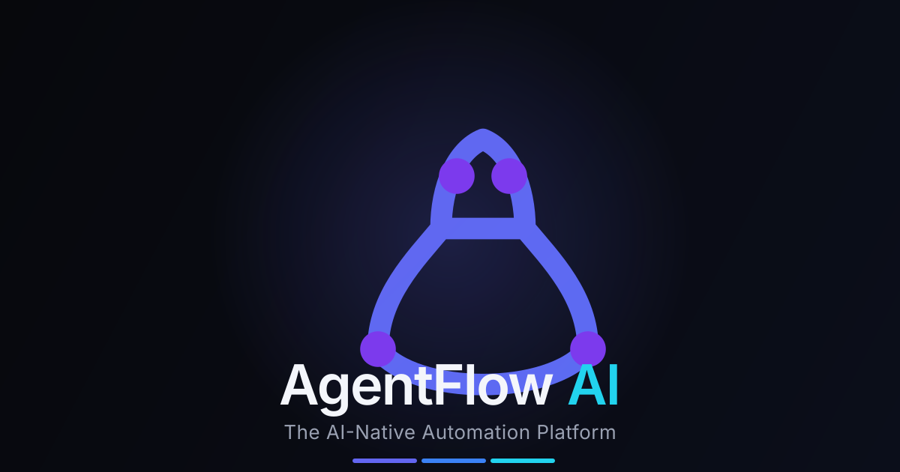

<p align="center">
  
</p>

<h1 align="center">AgentFlow AI</h1>

<p align="center">
  <strong>The AI-Native Automation Platform.</strong><br />
  Workflows that <em>think, plan, reason, remember, and self-heal</em> — orchestrated by autonomous agents across 60+ integrations.
</p>

<p align="center">
  <a href="https://github.com/zaydhassan/AgentFlowAI/actions/workflows/ci.yml"></a>
  <a href="https://github.com/zaydhassan/AgentFlowAI"></a>
  <a href="https://github.com/zaydhassan/AgentFlowAI/blob/master/LICENSE"></a>
  <a href="https://nextjs.org"></a>
  <a href="https://www.typescriptlang.org"></a>
</p>

<p align="center">
  
</p>

---

## What is AgentFlow AI?

AgentFlow AI is a **production-grade frontend for the next generation of workflow
automation**, where AI is the engine rather than a bolt-on. Every workflow runs
inside an AI runtime that reasons over each step, stores long-term memory,
recovers from failures automatically, and is continuously optimized by a copilot.

It is **not** an n8n clone. It ships as a fully runnable Next.js 16 app with a
premium dark / glassmorphism design system, a React Flow visual builder, and a
mock execution engine that makes every screen feel real — with **zero external
API cost**.

> Open the app and head straight to **/dashboard** for the live product, or
> **/** for the marketing site. The command palette is everywhere with `⌘K` /
> `Ctrl+K`.

---

## ✨ Features

- **Visual workflow builder** — drag & drop, zoom, minimap, snap-to-grid,
  animated edges, custom nodes (icon, status, duration, retries, log line).
- **60+ node library** across 8 categories, searchable, draggable onto the
  canvas.
- **Mock execution engine** — `Run` animates nodes through
  `running → retrying → succeeded/failed`, streams live logs, surfaces
  reasoning steps on AI nodes.
- **AI Copilot panel** — three tabs:
  - **Build** — natural language → planner generates a workflow
  - **Advice** — copilot suggestions (missing nodes, architecture, cost,
    performance, security) + chat
  - **Self-heal** — paste an error, diagnose root cause, apply fixes, "learn"
    the pattern
- **Pages & dashboards** — `/dashboard`, `/workflows`, `/executions`,
  `/marketplace`, `/observability`, `/ai/agents`, `/ai/memory`, `/ai/rag`,
  `/settings`, `/settings/billing`.
- **Design system** — Tailwind v4, glassmorphism, animated gradient text, mesh
  backgrounds, Framer Motion entrance animations, custom dark React Flow
  theming, command palette, keyboard shortcuts (`⌘Z`, `⌘C/V`, `Delete`).
- **Auth & billing** — Auth.js v5 with Google/GitHub OAuth, Stripe-backed
  plans (Pro / Business) with usage, invoices, and portal integration.
- **Mock-first** — every backend (auth, execution, AI, billing) is mocked
  behind a clean `lib/mock/*` seam so a real backend drops in without
  touching the UI.

---

## 🧱 Tech stack

- **Next.js 16.2** (App Router, Turbopack, React 19.2)
- **TypeScript 5**, **Tailwind CSS v4**
- **@xyflow/react 12** (React Flow) · **Framer Motion 12** · **Recharts 3**
- **Auth.js v5** · **Prisma 6** · **Stripe 22** · **Resend 6**
- **lucide-react** · **class-variance-authority** · **zod** · **bcryptjs**

---

## 📸 Screenshots


| Landing page | Dashboard | Workflow builder |
| :---: | :---: | :---: |
|  |  |  |
| _Marketing site (`/`)_ | _Live KPIs & charts (`/dashboard`)_ | _Visual builder (`/workflows/[id]`)_ |

| Execution timeline | AI Copilot | Observability |
| :---: | :---: | :---: |
|  |  |  |
| _Animated run + reasoning_ | _Build / Advise / Self-heal_ | _Latency, cost, audit_ |

> **Tip:** Capture full-page screenshots with `?fullPage=1` in
> [GoFullPage](https://chrome.google.com/webstore/detail/gofullpage-full-page-scre/fdpohaocaehifdmcenkpecnjijihfion),
> or use a 1280×800 viewport in your browser devtools.

---

## 🚀 Quick start

```bash
# 1. Install
npm install

# 2. Set up env (optional — the app runs with mocks out of the box)
cp .env.example .env
# Fill in any keys you want to use (OAuth, Stripe, Resend, etc.).
# Leave them blank to stay in fully-mocked mode.

# 3. Generate the Prisma client (only needed if you wire up the real DB)
npx prisma generate

# 4. Run
npm run dev      # http://localhost:3000
```

Other scripts:

```bash
npm run build    # production build (Turbopack) — passes clean
npm run start    # serve the production build
npx tsc --noEmit # type-check
```

---

## 🗂️ Project structure

```
app/
  (app)/                 # authenticated app shell (sidebar + topbar + ⌘K)
    dashboard/  workflows/  executions/  marketplace/
    observability/  ai/  settings/
  about/  changelog/  contact/  docs/  pricing/
  privacy/  security/  terms/  login/  signup/
  layout.tsx  page.tsx    # landing
components/
  ui/                    # design-system primitives
  layout/                # sidebar, topbar, command palette, app shell
  workflow/              # custom node, palette, inspector, copilot panel
  dashboard/  auth/  marketing/  billing/
lib/
  nodes.ts               # the 60+ node marketplace definition
  types.ts               # shared domain types
  mock/                  # data, execution engine, AI — the swap-me seam
actions/                 # server actions (auth, contact)
prisma/                  # schema + migrations
brand/                   # brand system (mark, social preview, showcase)
public/                  # static assets
```

---

## 🔐 Security

- All secrets live in `.env`, which is **gitignored**.
- `.env.example` is a blank template — safe to commit.
- Auth uses Auth.js v5 with a Prisma adapter; passwords are hashed with
  bcryptjs.
- API keys are managed in the in-app **Secrets Manager** (`/settings`).
- See [`/security`](app/security/page.tsx) for the full policy.

If you find a vulnerability, please email **zaydthirteen@gmail.com** rather
than opening a public issue.

---

## 🛣️ Roadmap

AgentFlow AI is intentionally a **frontend-first, mocked-backend** deliverable.
The mock layer (`lib/mock/*`) is the single seam where a real backend plugs in:

- [ ] Real LLM calls (OpenAI / Anthropic / Gemini) behind `lib/mock/ai.ts`
- [ ] FastAPI + Celery + Redis execution runtime
- [ ] Real Postgres deploy (Neon / Supabase / Vercel Postgres)
- [ ] Real Stripe Checkout + webhooks + customer portal
- [ ] Real Google + GitHub OAuth
- [ ] Webhooks for workflow triggers
- [ ] Team & RBAC enforcement at the API layer
- [ ] Docker / Helm chart for self-hosted deploys

---

## 👤 Author

Built by **[Zayd Hassan](https://github.com/zaydhassan)** — a portfolio
flagship project.

- GitHub: [@zaydhassan](https://github.com/zaydhassan)
- Email: **zaydthirteen@gmail.com**
- Project: [zaydhassan/AgentFlowAI](https://github.com/zaydhassan/AgentFlowAI)

---

## 📄 License

Released under the [MIT License](LICENSE).

> © AgentFlow AI — _the AI-native automation platform._
